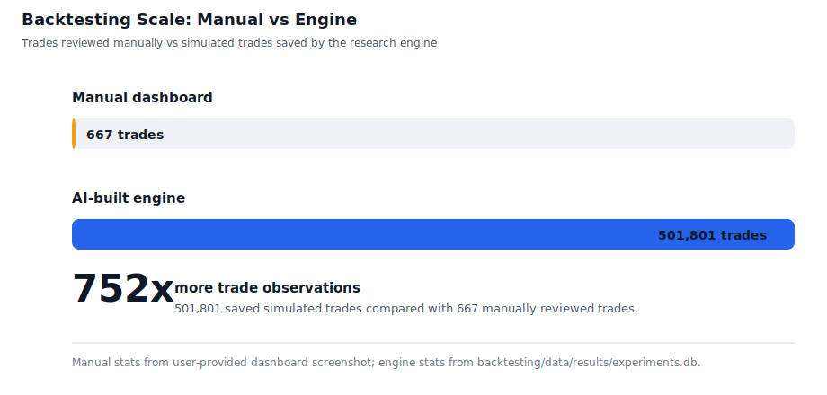

# Scale Yourself Report: Trading Engine

Generated: 2026-05-21 15:25

## Short summary

Prior to this engine, I used a paid platform called FXReplay to conduct all my backtests for optimizing and collecting "data" on my strategies. On this platform I would manually rewind the price action on a chart, replay it bar by bar and record trades manually. Totalling over ~30 hours, I managed to collected about 667 trades worth of data. I used Claude Code and Codex to help turn that workflow into a repeatable futures research system: strategy configs, saved backtests, experiment tracking, research notes, TradingView parity work, execution plumbing, and dashboard review all living in one loop.

This report does not claim access to raw Codex token history. It uses local evidence that can be audited from the repo: git history, the experiment database, tracked research artifacts, and the user-provided manual backtesting dashboard screenshot.

## Key metrics

- 225 commits across the measured window.
- 622,999 total changed lines recorded by git numstat.
- 1,419 saved backtest runs in `backtesting/data/results/experiments.db`.
- 501,801 simulated trades represented by those saved runs.
- 752x more saved simulated trade observations than the 667 manually reviewed trades shown in the dashboard screenshot.
- 4 saved optimization records, covering 1,284 parameter combinations.
- 226 tracked long-form research reports under `backtesting/learnings/reports/`.
- 268 tracked learning-memory Markdown files under `backtesting/learnings/`.

## Manual backtesting vs engine scale

The clearest leverage signal is not a commit curve. This repository started while I was already using AI, so git history does not show a clean before/after inflection. The stronger comparison is the manual backtesting ceiling versus the AI-built research engine.

Manual dashboard baseline:

- Trades reviewed: 667.

Engine output:

- Saved backtest runs: 1,419.
- Simulated trades: 501,801.
- Trade-observation multiple: 752x the manually reviewed trade count.
- Optimization records: 4, covering 1,284 parameter combinations.

## Monthly throughput

| Month | Commits | LOC changed | Saved research runs | Simulated trades | Optimizations |
| --- | ---: | ---: | ---: | ---: | ---: |
| 2026-01 | 29 | 16,764 | 0 | 0 | 0 |
| 2026-02 | 60 | 246,239 | 0 | 0 | 0 |
| 2026-03 | 95 | 152,391 | 1,382 | 463,370 | 4 |
| 2026-04 | 22 | 125,173 | 16 | 22,554 | 0 |
| 2026-05 | 19 | 82,432 | 21 | 15,877 | 0 |

## What scaled

The biggest improvement was not only writing more code. It was compressing the loop from idea to evidence:

1. Strategy hypothesis becomes configurable engine behavior.
2. Backtest or sweep becomes a saved database record.
3. Results become a research report or learning-memory update.
4. Promising ideas are promoted toward dashboard review, TradingView parity, or execution replay.

That loop created measurable leverage: March alone produced 1,382 saved research runs and 463,370 simulated trades, while the repo also had 95 commits.

## Examples

- Backtesting/research engine: ORB, FVG, LSI, HTF-LSI, CISD, IB, VWAP, gap-fill, news, regime, and portfolio workflows are represented in `backtesting/`.
- Experiment tracking: saved runs and optimizations are queryable from the SQLite experiment DB, making research output durable instead of living only in chat.
- Research memory: `backtesting/learnings/` contains reusable strategy findings and promotion reports, including 226 tracked report files.
- Execution bridge: `execution/` connects DataBento, execution engines, TradersPost service behavior, historical replay, and deploy configs.
- Frontend review loop: `frontend/` contains the React dashboard used to inspect research and execution outputs.
- TradingView parity: `pinescript/` contains alert-parity and reference scripts so research can be compared against chart behavior.

## Research output by instrument

- NQ: 1,363 saved runs, 409,508 simulated trades, 40,847.8 total R
- MULTI: 31 saved runs, 74,396 simulated trades, 17,203.1 total R
- ES: 18 saved runs, 12,668 simulated trades, 1,702.7 total R
- GC: 3 saved runs, 2,362 simulated trades, 257.4 total R
- CL: 2 saved runs, 1,259 simulated trades, 207.0 total R
- RTY: 1 saved runs, 911 simulated trades, 61.6 total R
- MNQ: 1 saved runs, 697 simulated trades, -3.6 total R

## Repo surface area

- backtesting: 1,142 tracked files
- execution: 58 tracked files
- frontend: 121 tracked files
- pinescript: 68 tracked files
- root/other: 185 tracked files

## Measurement notes

- Git activity comes from `git log --all --numstat`, grouped by commit month.
- Research activity comes from `backtesting/data/results/experiments.db`.
- Manual baseline stats come from the user-provided backtesting dashboard screenshot dated 2026-05-21.
- The root `backtesting/experiments.db` currently has no tables; the active experiment store is `backtesting/data/results/experiments.db`.
- LOC changed is a throughput proxy, not a quality metric. The stronger signal is the linked loop of implementation, saved experiments, research reports, and deployability review.
- Raw Codex tokens were not available, so this report uses output-side proxies instead of token-side telemetry.
